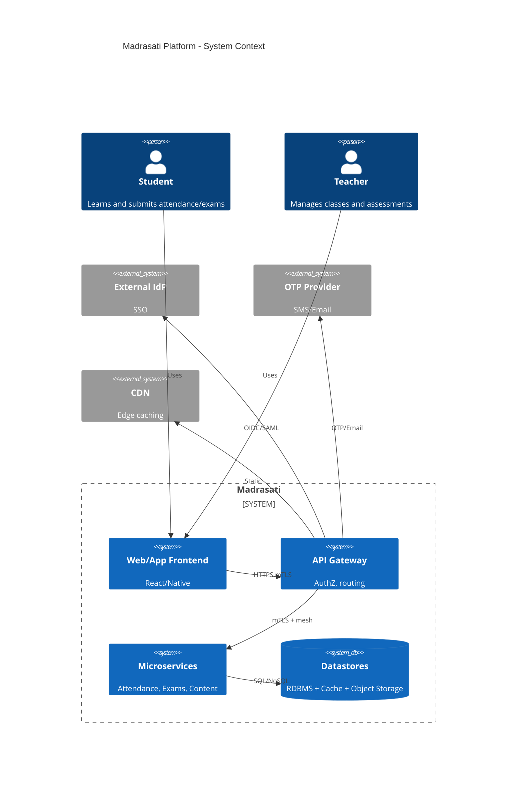
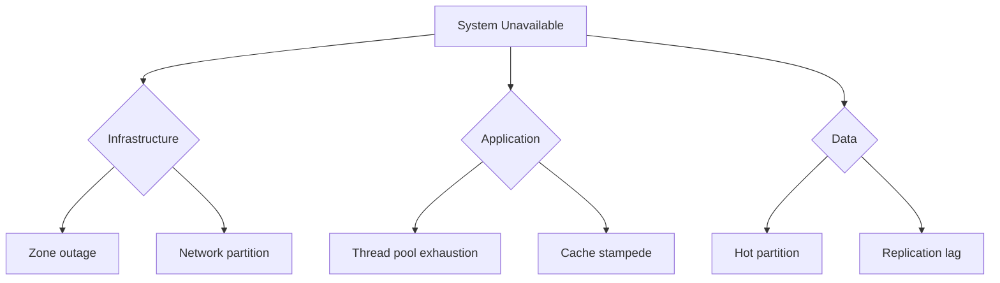
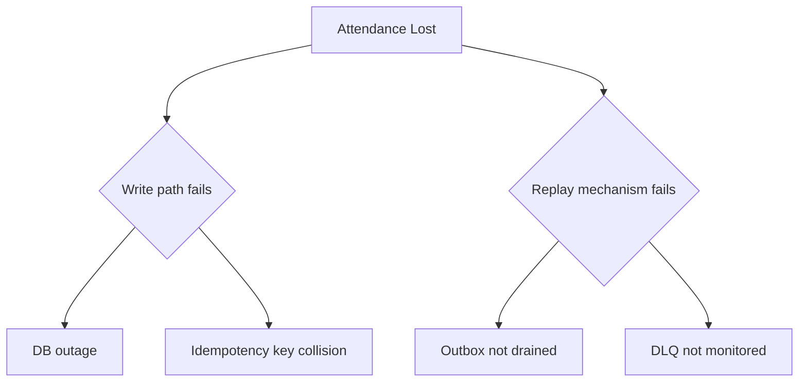

# Diagrams

## C4 System Context

```mermaid
C4Context
title Madrasati Platform - System Context
Person(student, "Student", "Learns and submits attendance/exams")
Person(teacher, "Teacher", "Manages classes and assessments")
System_Boundary(madrasati, "Madrasati"){
  System(web, "Web/App Frontend", "React/Native")
  System(api, "API Gateway", "AuthZ, routing")
  System(services, "Microservices", "Attendance, Exams, Content")
  SystemDb(db, "Datastores", "RDBMS + Cache + Object Storage")
}
System_Ext(idp, "External IdP", "SSO")
System_Ext(otp, "OTP Provider", "SMS/Email")
System_Ext(cdn, "CDN", "Edge caching")
Rel(student, web, "Uses")
Rel(teacher, web, "Uses")
Rel(web, api, "HTTPS mTLS")
Rel(api, services, "mTLS + mesh")
Rel(services, db, "SQL/NoSQL")
Rel(api, cdn, "Static")
Rel(api, idp, "OIDC/SAML")
Rel(api, otp, "OTP/Email")
```

## Fault Tree: System Unavailability

```mermaid
flowchart TD
A[System Unavailable] --> B{Infrastructure}
A --> C{Application}
A --> D{Data}
B --> B1[Zone outage]
B --> B2[Network partition]
C --> C1[Thread pool exhaustion]
C --> C2[Cache stampede]
D --> D1[Hot partition]
D --> D2[Replication lag]
```

## Fault Tree: Attendance Loss Event

```mermaid
flowchart TD
A[Attendance Lost] --> B{Write path fails}
A --> C{Replay mechanism fails}
B --> B1[DB outage]
B --> B2[Idempotency key collision]
C --> C1[Outbox not drained]
C --> C2[DLQ not monitored]
```
