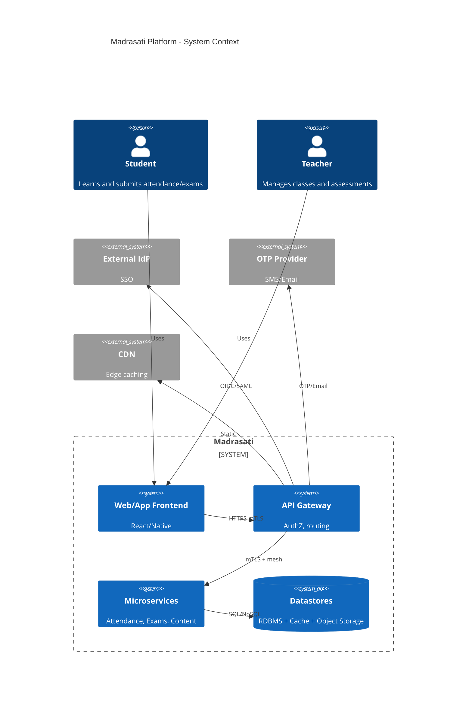
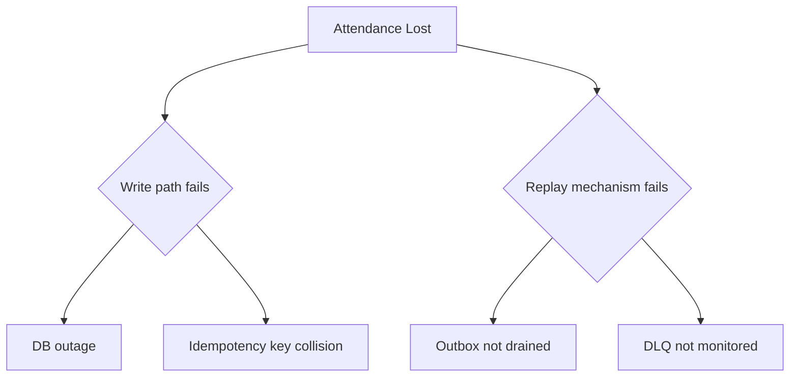

# Diagrams

## C4 System Context



## Fault Tree: System Unavailability

```mermaid
flowchart TD
  A[Platform Unavailable During Exam]
  A --> B{Network Layer Failure}
  A --> C{Application Layer Failure}
  A --> D{Data Layer Failure}
  A --> E{Human/Process Errors}

  B --> B1[Cloud provider outage]
  B --> B2[DDoS attack on front-end services]

  C --> C1[Exam microservice crash due to unhandled exceptions]
  C --> C2[Overloaded assignment submission service (peak traffic)]

  D --> D1[Database server crash (single point of failure)]
  D --> D2[Inconsistent replication between database nodes]

  E --> E1[Incorrect system configuration before exam period]
  E --> E2[Late patching introducing new bugs]
```

## Fault Tree: Attendance Loss Event


